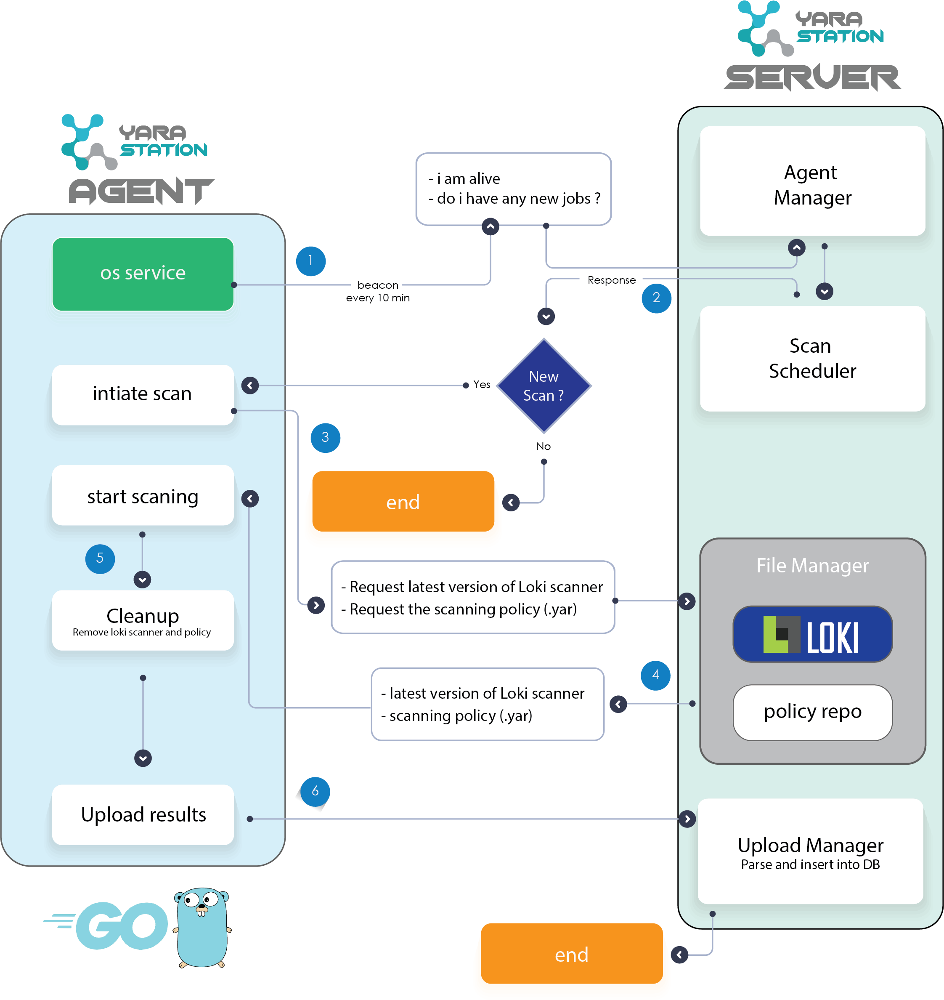
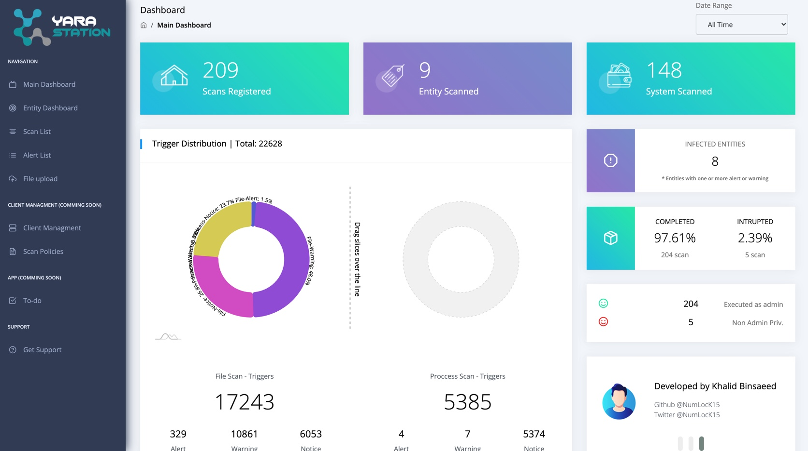
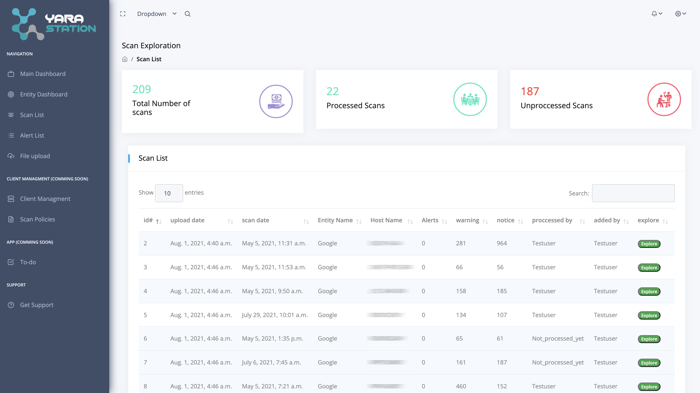
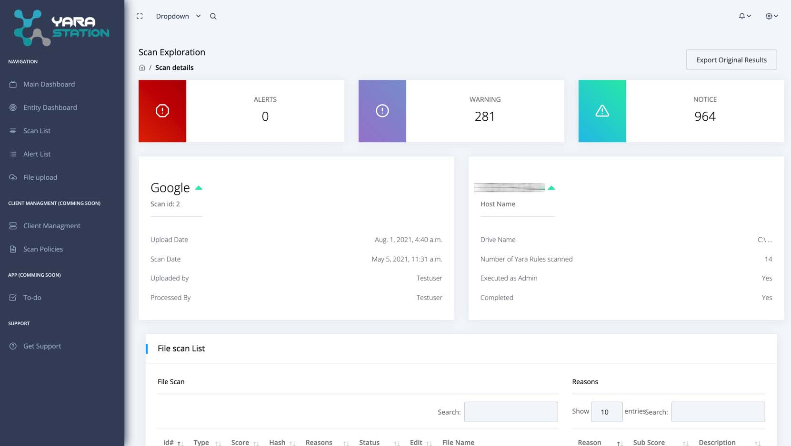
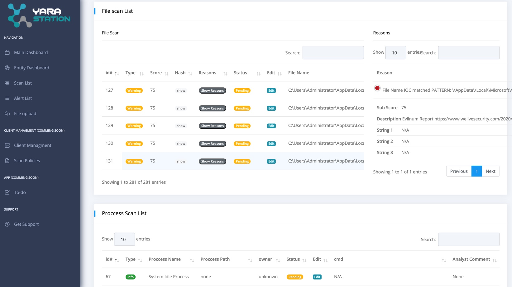
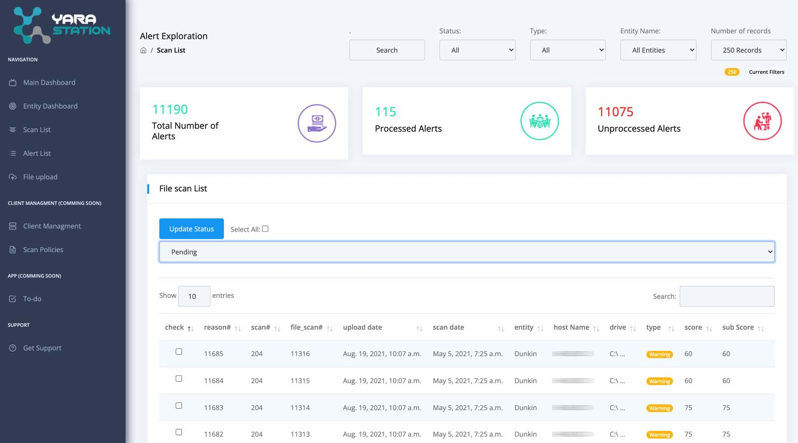

    

  
# Yara Station- Managment portal for LoKi scanner

Yara station is a managment portal designed to facilitate the use of (Neo23x0 / Loki scanner).  

it was created to act as a workaround solution for orgnizations that do not have an enterprise solution to manage thier yara scanning activities.

The idea is to use loki scanner as the base for all scanning activities, and to parse and aggregate all the results in a centralized database to facilitie the following:

    1. Storing/archiving yara results.
    2. Creating dashboards
    3. Scanning clients/servers centrally (comming soon)

       

## How-To Run Yara Station 

### Run (Option 1 - Using Docker) Recomended: 

    sudo apt update
    sudo apt install docker-compose
    git clone https://github.com/NumLocK15/yarastation/
    cd yarastation/
    sudo docker-compose -f docker-compose-deploy.yml up -d
    
That is it :) .. Now you can access the portal on http://localhost

### Run (Option 2 - Running it directly without docker) 

    #download the code
    git clone https://github.com/NumLocK15/yarastation/
    cd  yarastation/app
    
    #setup the virtual environemt and download requirments
    sudo apt update
    sudo apt install virtualenv
    sudo virtualenv env
    source env/bin/activate
    pip3 install -r requirements-standalone.txt 
    
    ## Important Steps:
    1) replace core/setting.py with core/setting-standalone.py by renaming the latter.
    2) locate core/urls.py and remove setting.debug section
   
    # Create tables in db
    python manage.py makemigrations
    python manage.py migrate
    
    # Start the application 
    python manage.py runserver 0.0.0.0:8015 --insecure

That is it :) .. Now you can access the portal on http://localhost:8015

Notes: 
1) in the standalone version the app will create and run on SQLite instance rather than postgres which is used in the docker, which may cause concurrency issues. you can also link to any other existing database in your environment (read django documentioans) 

## Managing Agent installtion

### Step (1): Generate the authorization token:   
    
    (On docker-compose installation)
    # Run the following commands
    docker exec -it yarastation_app_1 chmod +x generate_token_scripts/generate_token.sh
    docker exec -it yarastation_app_1 generate_token_scripts/generate_token.sh
    docker exec -it yarastation_app_1 cat /app/generate_token_scripts/agent_token.txt
    # copy the generated token as it will be used in later stages. 

### Step (2): install the agent:
    (Option 1: running the agent as an executable.)
    1) unzip the release version of the agent in a location of your choosing (PS: this will be your installation folder and it should not be moved)
    2) Generate the config file (ys_config.txt) by running generate_config.ps1..
    3) Run the executable using the command prompt and give the location of the config as an argument (example: yarastation_agent.exe "C:\ys_config.txt")
    DONE!! now you can manage your system from the server.

    (Option 2: running the agent as an service.) (Recomended)
    1) unzip the release version of the agent in a location of your choosing (PS: this will be your installation folder and it should not be moved)
    2) execute the powershell script "install_yarastation_agent.ps1" follow the commands then finish.
    3) go to windows services, find yarastation and start the service. 
    DONE!! now you can manage your system from the server.

### Agent Archtecture:

    

## Disclaimer
The portal is still in the earlly development phases, it is recommended to run it in a controlled environemnt that does not have internet access. 

## Roadmap
    1. (live) Provide support for Uploading/Parsing loki results
    2. (live) Provide support for managment agents to run scans from a centralized location
    3. (Coming soon - Testing phases) Agent Support for UNIX systems
    4. (Coming soon - still collecting data) Provide support for Uploading/Parsing results from different sources (e.g. Thor scanner, EDRs etc.)
    
## Screenshots

    
    
    
    
        

